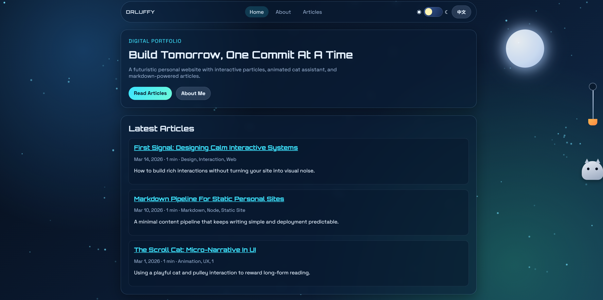

<div align="center">
  
</div>


<div align="center">
  
</div>
<p align="center"><a title="Chinese" href="README.md">中文</a>  |  English</p>


`Drluffy` is a futuristic personal website deployable on GitHub Pages, built with pure `HTML/CSS/JavaScript`.

## Features

- Futuristic background with mouse-following particle effects
- Day (sun rise) / Night (moon glow) smooth theme toggle
- Explore entry layer with fade-out + depth animation; shown once per browser session by default
- Wallpapers, gallery, greetings, and cat SVG can all be deployed as repository assets
- `Home / About / Articles / Article` multi-page structure
- Markdown-driven article system (JSON generated by script)
- On first visit only the background is shown; click `Explore` to enter
- About page supports avatar photo and social icon row (X / Telegram / Email / GitHub)
- Right-side cat pulley-rope scroll interaction; jumping + greeting text triggers at the bottom
- 30-second idle photo slideshow with click-to-zoom, aspect-ratio-fit display, auto-rotate, and swipe support
- EN / 中文 language toggle in the top-right corner

## One-click Commands (Luffy CLI)

The project ships a built-in `Luffy` CLI for install, run, and content management.

### Option A: Run directly inside the project

```bash
node scripts/luffy.js install
node scripts/luffy.js run
```

Create an article:

```bash
node scripts/luffy.js create-article --title "My New Post" --lang en
```

### Option B: Install as a global command

Run in the project root:

```bash
npm install -g .
```

Then use anywhere:

```bash
Luffy install
Luffy run --port=4173
Luffy create-article --title "My New Post" --lang en
Luffy create-page --name portfolio --title "Portfolio"
Luffy delete-page --name portfolio
```

### Command reference

- `Luffy install`
   - Installs dependencies and runs the content build automatically
- `Luffy run [--port=4173]`
   - Builds content data and starts a local static server
- `Luffy create-article --title "..." [--lang zh|en] [--slug custom-slug]`
   - Creates a Markdown article and updates `data/articles.json` automatically
- `Luffy create-page --name portfolio [--title "Portfolio"]`
   - Scaffolds a new standalone page (root-level `.html` with full site structure)
- `Luffy delete-page --name portfolio [--force]`
   - Deletes a page file; deleting core pages `index/about/articles/article` requires `--force`

## Common npm scripts

```bash
npm run build:content
npm run run
npm run create-article -- --title "Hello"
npm run create-page -- --name portfolio --title "Portfolio"
npm run delete-page -- --name portfolio
```

## Article format

Place articles in `content/posts/*.md`:

```md
---
title: "Article title"
date: 2026-03-14
tags: ["TagA", "TagB"]
excerpt: "Short summary"
cover: "/assets/images/covers/article-cover.jpg"
slug: "article-slug"
---

## Section

Content...
```

## Language toggle

- The language button in the top-right corner switches between `EN` and `中文`
- Language preference is saved in `localStorage` under the key `drluffy.lang`

## Deployed resource configuration

The frontend no longer provides an image upload UI. Wallpapers, gallery photos, greetings, and cat SVG are deployed as repository files.

Core config file: `data/site-config.json`

Default structure:

```json
{
   "theme": "night",
   "enableExploreGate": true,
   "entry": {
      "titleTypeSpeedMs": 38,
      "subtitleTypeSpeedMs": 18,
      "subtitleDelayMs": 180,
      "blinkMinOpacity": 0.45,
      "blinkGlowAlpha": 0.55,
      "blinkGlowSizePx": 10,
      "leaveDurationMs": 430
   },
   "enableIdleSlideshow": true,
   "idleTimeoutMs": 30000,
   "slideshowIntervalMs": 4500,
   "particles": {
      "dayDesktop": 260,
      "nightDesktop": 180,
      "dayMobile": 110,
      "nightMobile": 70
   },
   "wallpaper": {
      "day": "",
      "night": "",
      "default": ""
   },
   "gallery": [],
   "greetings": ["Hi", "Hello"],
   "cat": {
      "svg": ""
   },
   "visits": {
      "enabled": true,
      "provider": "countapi",
      "namespace": "drluffy",
      "key": "site"
   }
}
```

### Configure the Explore entry gate

Set in `data/site-config.json`:

```json
"enableExploreGate": true
```

- `true`: Enables the Explore entry. The gate appears on first visit; it only shows once per browser session.
- `false`: Disables the gate; the page content is shown immediately.

The entry layer includes:
- `System Ready` blink animation
- `Drluffy` title and subtitle typewriter effect
- Fade-out + depth transition after clicking `Explore`

To prevent flickering on page navigation, the site evaluates the session state as early as possible (before rendering) to decide whether to show the gate.

### Configure Explore animation parameters

Set in `data/site-config.json` under `entry`:

```json
"entry": {
   "titleTypeSpeedMs": 38,
   "subtitleTypeSpeedMs": 18,
   "subtitleDelayMs": 180,
   "blinkMinOpacity": 0.45,
   "blinkGlowAlpha": 0.55,
   "blinkGlowSizePx": 10,
   "leaveDurationMs": 430
}
```

- `titleTypeSpeedMs` / `subtitleTypeSpeedMs`: Typing speed in ms (smaller = faster)
- `subtitleDelayMs`: Pause between title and subtitle
- `blinkMinOpacity`: Minimum opacity during blink
- `blinkGlowAlpha`: Glow intensity (0–1)
- `blinkGlowSizePx`: Glow spread in pixels
- `leaveDurationMs`: Duration of the exit fade + depth transition after clicking Explore

### Configure the footer visit counter

The footer displays a visit count, backed by `countapi` by default.

```json
"visits": {
   "enabled": true,
   "provider": "countapi",
   "namespace": "drluffy",
   "key": "site"
}
```

- `enabled`: Toggle the counter on or off
- `provider`: Currently supports `countapi`; any other value falls back to a local counter
- `namespace` + `key`: Counter identifier
- When the remote service is unavailable, a local count is displayed as fallback

### Configure background particle count

```json
"particles": {
   "dayDesktop": 260,
   "nightDesktop": 180,
   "dayMobile": 110,
   "nightMobile": 70
}
```

- Day mode defaults to more and brighter particles
- Counts can be tuned separately by device and theme

### Configure idle slideshow

```json
"enableIdleSlideshow": true
```

- `true`: Idle slideshow is active
- `false`: Slideshow is disabled even if `gallery` is configured

### Configure wallpaper

1. Place images in `assets/images/wallpapers/`
2. Set paths in `data/site-config.json`:

```json
"wallpaper": {
   "day": "/assets/images/wallpapers/day.jpg",
   "night": "/assets/images/wallpapers/night.jpg",
   "default": "/assets/images/wallpapers/night.jpg"
}
```

### Configure gallery

1. Place images in `assets/images/gallery/`
2. Set the `gallery` array in `data/site-config.json`:

```json
"gallery": [
   {
      "src": "/assets/images/gallery/photo-1.jpg",
      "alt": "Sunrise over the city",
      "altZh": "城市日出",
      "caption": "Shot on a quiet morning.",
      "captionZh": "清晨拍摄。"
   },
   {
      "src": "/assets/images/gallery/photo-2.jpg",
      "alt": "Studio desk",
      "altZh": "工作台",
      "caption": "Workspace details.",
      "captionZh": "桌面细节。"
   }
]
```

Notes:
- Slideshow activates after 30 seconds of inactivity
- Photos are displayed fully fitted to the frame at their original aspect ratio
- Click to zoom; swipe left/right on touch devices or use arrow buttons

### Configure greetings

```json
"greetings": ["Hi", "Hello", "欢迎回来", "Good to see you"]
```

After exiting the slideshow, the cat picks a random greeting from this list.

### Configure cat SVG

1. Place the SVG file in `assets/images/cat/`
2. Set the path in `data/site-config.json`:

```json
"cat": {
   "svg": "/assets/images/cat/custom-cat.svg"
}
```

Notes:
- Without `cat.svg`, the site uses the built-in CSS cat
- With `cat.svg`, the site switches to your SVG while keeping the scroll interaction and jump animation

### Configure About avatar and socials

1. Place your avatar at `assets/images/about-photo.jpg` (rename as needed, then update `about.html` accordingly)
2. Update social links in `about.html`:
   - X: `https://x.com/...`
   - Telegram: `https://t.me/...`
   - Email: `mailto:...`
   - GitHub: `https://github.com/...`

## Deployment (GitHub Pages)

1. Create a GitHub repository and push the code to the `main` branch.
2. Confirm the workflow file exists: `.github/workflows/deploy.yml`.
3. Open the repository `Settings → Pages`.
4. Under **Build and deployment**, set **Source** to **GitHub Actions**.
5. Return to the **Actions** tab and confirm the `Deploy GitHub Pages` workflow succeeds.
6. After deployment, visit:
   - User homepage repo: `https://<username>.github.io/`
   - Project repo: `https://<username>.github.io/<repo>/` (this project is designed for root-path deployment; a user homepage repo is recommended)
7. Every push to `main` triggers an automatic re-deploy.

## Pre-publish checklist

1. Build article data locally: `Luffy install` or `npm run build:content`
2. Local preview: `Luffy run`
3. Verify pages: `Home / About / Articles / Article` all accessible
4. Verify interactions: particles, day/night toggle, cat scroll, 30-second idle slideshow, zoom, exit greeting
5. Verify language toggle: EN ↔ 中文 for both static text and dynamic pagination labels
6. Verify all configured wallpapers, gallery photos, greetings, and cat SVG load correctly
7. Verify first visit shows only the background with `Explore`; click enters the site

## Directory overview

- `index.html` / `about.html` / `articles.html` / `article.html`
- `assets/css/*`
- `assets/js/*`
- `content/posts/*.md`
- `scripts/luffy.js` / `scripts/build-content.js` / `scripts/serve.js`
- `data/articles.json`, `data/article-map.json`

## Notes

- Wallpapers, gallery, greetings, and cat SVG are deployed as repository files — no browser-side upload needed.
- On low-performance devices or when the OS reduce-motion setting is active, animations degrade gracefully.
